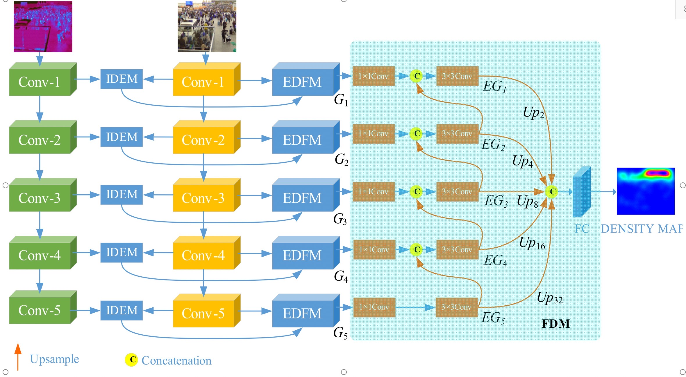
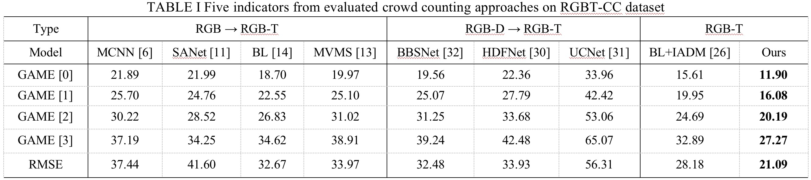

# DEFNet
DEFNet: Dual-Branch Enhanced Feature Fusion Network for RGB-T Crowd Counting（[paper](https://ieeexplore.ieee.org/document/9889192)）

# Requirements
Python3.6, Pytorch 1.5.0+, Cuda 10.2, Opencv-python

# Results

Pretrained model download:[百度网盘（PW:zust）](https://pan.baidu.com/s/1RjOA05BFV7TOOIeo1_Aqow?pwd=zust)

Test maps:[百度网盘（PW:zust）](https://pan.baidu.com/s/1qsR5CjgbqQKafTzu-b-I4A?pwd=zust)

# Citation
@ARTICLE{9889192,  
author={Zhou, Wujie and Pan, Yi and Lei, Jingsheng and Ye, Lv and Yu, Lu},  
journal={IEEE Transactions on Intelligent Transportation Systems},   
title={DEFNet: Dual-Branch Enhanced Feature Fusion Network for RGB-T Crowd Counting},   
year={2022},    
pages={1-10},  
doi={10.1109/TITS.2022.3203385}}

# Acknowledgement
The implement of this project is based on the code of ["Cross-Modal Collaborative Representation Learning and a Large-Scale
 RGBT Benchmark for Crowd Counting"](https://ieeexplore.ieee.org/document/9578312) proposed Liu et al.

# Contact
Please drop me an email for further problems or discussion: wujiezhou@163.com or 281775411@qq.com
